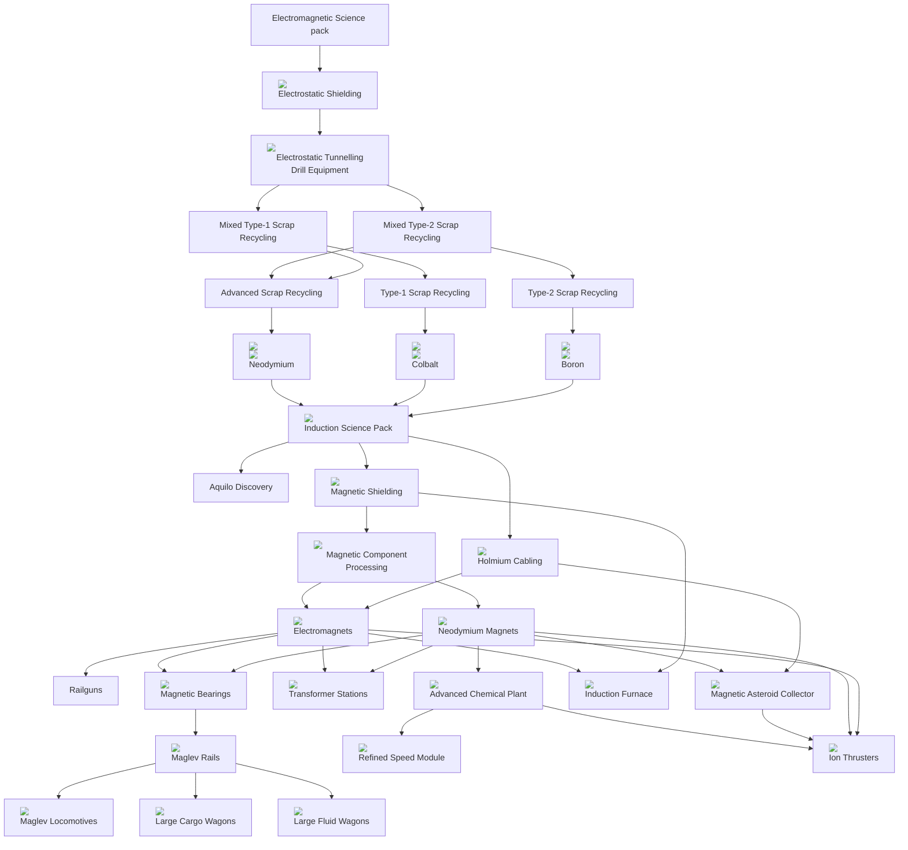

### Fulgora TODO
1. Before Release
    1. ~~Fix the fulgoran subway space map icon location~~
    1. ~~Double-check all locale strings are done~~
    1. ~~Update new scrap types to have more output volume~~
    1. Make magnetic components only in mag component assembler
    1. Finish replacing all entities with broken ones
    1. Make a few more room blueprints
    1. Comment-out magnetic bearings
    1. Update version numbers
    1. Update release notes
    1. Credits updates?
1. Behavioral
    1. ~~Figure out how to make straight-line terrain up-down and left-right for the subway tunnels~~
        1. ~~Could rails (or high-tech rails?) but added?~~
    1. ~~Figure out how to spawn a preset-style room on a specific point~~
        1. ~~These should have some sort of security door that the player has to destroy to enter and then they get swarmed by bugs~~
        1. ~~Make these presets act as more of a dungeon-crawler where the player has to choose to expand, and fight a wave to continue~~
    1. ~~Add weighting to fulgoran subway to make straightaways a bit more frequent and stations a bit less, with fewer intersections as well~~
    1. ~~Make rails not spawn adjacent to the starting room~~
    1. ~~Update rooms to not have doors that lead to the unconnected rails~~
        1. ~~Update other room doors than size-32 for this~~
    1. ~~Fix the issue where doors are not spawning next to rail stations since they are considered rails~~
    1. ~~Fix the issue where rails are spawning in a way trying to connect to the rooms that are adjacent to the starting area~~
    1. ~~Figure out how to replace entities with their destroyed versions for the environment decoratives~~
    1. ~~Fix the bug where rails think they can connect to a chunk with an adjacent pre-set station even though the station requires a room to be there~~
        1. ~~A potential fix is to fill in some room type in the `chunk_information` when a station is created~~
    1. ~~Design Fulgoran Subway tech tree~~
    1. ~~Design Fulgoran Subway enemy spawns~~
        1. ~~Cyber-biters that were expirimented on and escaped, killing all the Fulgorans but were driven back underground by the lightning storms. Could these escape to the surface?~~
        1. ~~Cyber-pentapods that are similar to the cyber biters~~
        1. ~~Cyber-demolishers?~~
    1. ~~Design advanced-scrap recycling loop similar to the fulgoran surface but with different recyclers to get different materials~~
        1. ~~Should there be different scrap types?~~
        1. ~~Should there be different scrapping buildings?~~
        1. ~~Having different types and recyclers could make it so that there is a multiplicative number of outputs, which could be good or bad (might be too complex)~~
    1. ~~Make a straight-in station along with all the pass-by ones~~
    1. ~~Create refined speed modules~~
    1. ~~Make the recipes have actual ingredients~~
    1. Update recipes that use neodymium magnets to output a magnetic package result
    1. Update recipes that use neodymium magnets to only work in a magnetic component assembler
    1. Add the new scraps to scrap recycling infinite researches
    1. Make infinite researches for boron, cobalt, and neodymium
    1. Create entities:
        1. Ion thrusters, include a postive and negatively charged fluid that powers the thruster and can only be made in the advanced chem plant
        1. Maglev rails and trains
        1. ~~Magnetic asteroid grabbers~~
        1. ~~Transformer stations~~
    1. Ordering on all items and entities
    1. Update the underground vaults to not have walls if the above-ground vault crosses a chunk boundary
    1. Make the mixed scrap spawns in the rooms more circular and varied
1. ~~Graphics~~
    1. ~~Design the flooring of the fulgoran subway~~
    1. ~~Design the underground fulgoran lab buildings~~
    1. ~~Re-visit the underground lighting in all rooms~~

## Tech Tree
