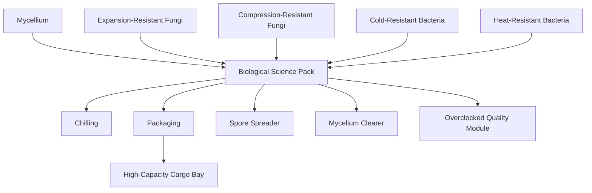
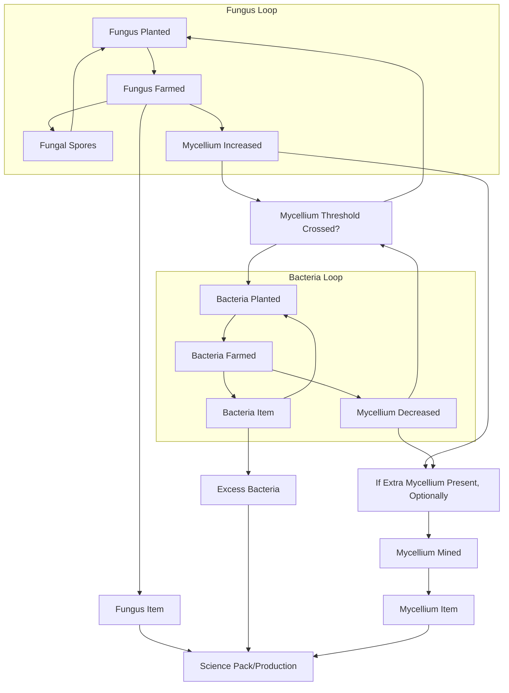

## Task List
* ~~Create the subterranean surface with the biospheres~~
* ~~Create the tech that will allow the player to reach the subterranean surface~~
* ~~Create mycellium tiles, item, and "ore"~~
* ~~Create expansion-resistant fungi~~
* ~~Create cold-resistant-bacteria~~
* Add fungi and bacteria farmed and planted events
* Create compression-resistant fungi
* Create heat-resistant-bacteria
* Create biological science pack
* Create chilling techs, entities, and items
* Create packaging techs, entities, and items
* Create spore spreader
* Create root clearer
* Create high-capacity cargo bay
* Create overclocked quality module
* Update locales
## Behavioral
* Mycelium mechanics:
    * Mycelium is created when Fungi is farmed
    * When above a certain density, the ground will change to a new tile type that allows bacteria to be grown and farmed
    * It is needed to plant bacteria, and the bacteria eats it to grow (it loses density)
    * Small patches will be present in the generated environment
* Expansion-Resistant Fungi
    * When farmed with an agricultural tower, this will add some Mycelium to a patch under the tower
    * Small amounts will be present in the environment
* Compression-Resistant Fungi
    * When farmed with an agricultural tower, this will add some Mycelium to a patch under the tower
    * Small amounts will be present in the environment
* Cold-Resistant Bacteria
    * This can only be farmed on mycelium tiles
    * Small amounts will be present in the environment
* Heat-Resistant Bacteria
    * This can only be farmed on mycelium tiles
    * Small amounts will be present in the environment
## Tech Tree
* Biological Science Pack
    * Takes all the bacteria types (even from surface), all the fungal types, and mycelium
* Chilling
    * Ice box - base package used for stopping spoilage
        * Recipe takes some iron/steel like a chest
    * Freezer - the machine that puts things into or takes things out of an ice box
        * Can also make ice out of water. The cryo plant also gets this recipe
    * Chilled X - recipes for putting things into an ice box
        * Takes 1(?) of the thing, an ice box, and some ice
        * Returns a chilled, boxed version of the item
    * Thawed X - recipes for taking things out of a box
        * Takes a chilled X
        * Returns the original item (at a pre-determined spoilage?)
        * Returns the ice box
        * Returns some water
* Packaging
    * Shipping box - base package used for sending large quantities of items through logistics
        * Recipe takes some iron/steel and all the different fungi/bacteria types from the underground
    * Packager - the machine that puts things into and takes things out of a shipping box
    * Packaged X - recipes for putting things into a shipping box
        * Takes a stack of the thing, a shipping box, and some nutrients (to grow the packaging material)
        * Returns a packaged version of the item
        * All packages have a stack size of 10-20, to multiply the density of items that can be moved around on rockets, trains, belts, etc
        * Frozen items can be packaged. Packaged items cannot be frozen
* Spore spreader - speeds up the growth speed of fungi and bacteria
* Root clearer - Mining drill that can only mine mycelium (and can read the density of the patch)
* High-capacity cargo bay - for space platforms
* Overclocked Quality Module
    * A quality module that pushes both quality and speed

## Tech Tree Diagram

## Fungal Cycle

