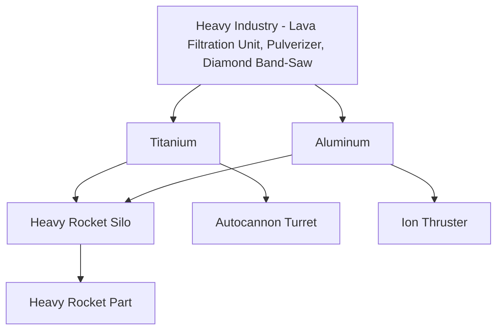
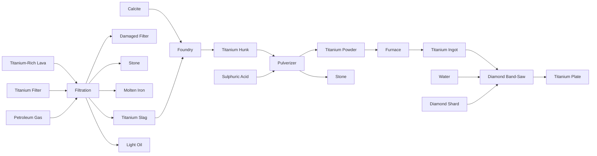
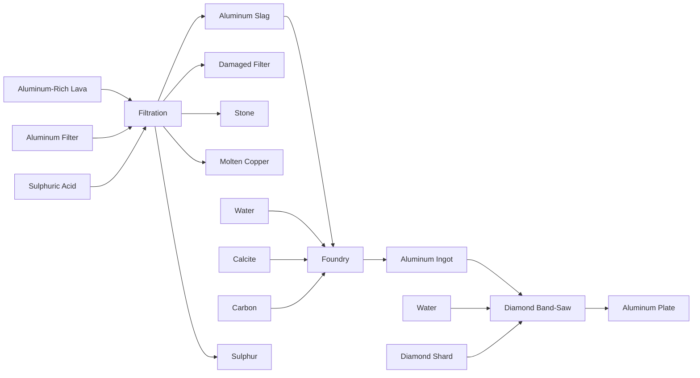

### Vulcanus TODO
1. Behavioral
    1. Rich-lava filtration machine
        1. Use re-colored chem plant
    1. Pulverizer machine
        1. Use re-colored crusher
    1. Diamond band-saw machine
        1. Use re-colored assembly machine
    1. Basic Lava Filter
        1. Tungsten Carbide
        1. Copper Cable
        1. Steel
    1. Damaged Lava Filter
    1. Titanium lava filter
    1. ~~Titanium-rich lava~~
    1. Titanium slag recipe
    1. Titanium hunk recipe
    1. Titanium powder recipe
    1. Titanium ingot recipe
    1. Titanium plate recipe
    1. Aluminum lava filter
    1. ~~Aluminum-rich lava~~
    1. Aluminum slag recipe
    1. Aluminum ingot recipe
    1. Aluminum plate recipe
    1. Heavy rocket part
    1. Heavy rocket silo
    1. Autocannon turrets
1. Enemies
    1. Infant/Adolescent demolishers
1. Graphics

## Tech Tree

## Titanium Processing Flow

## Aluminum Processing Flow
