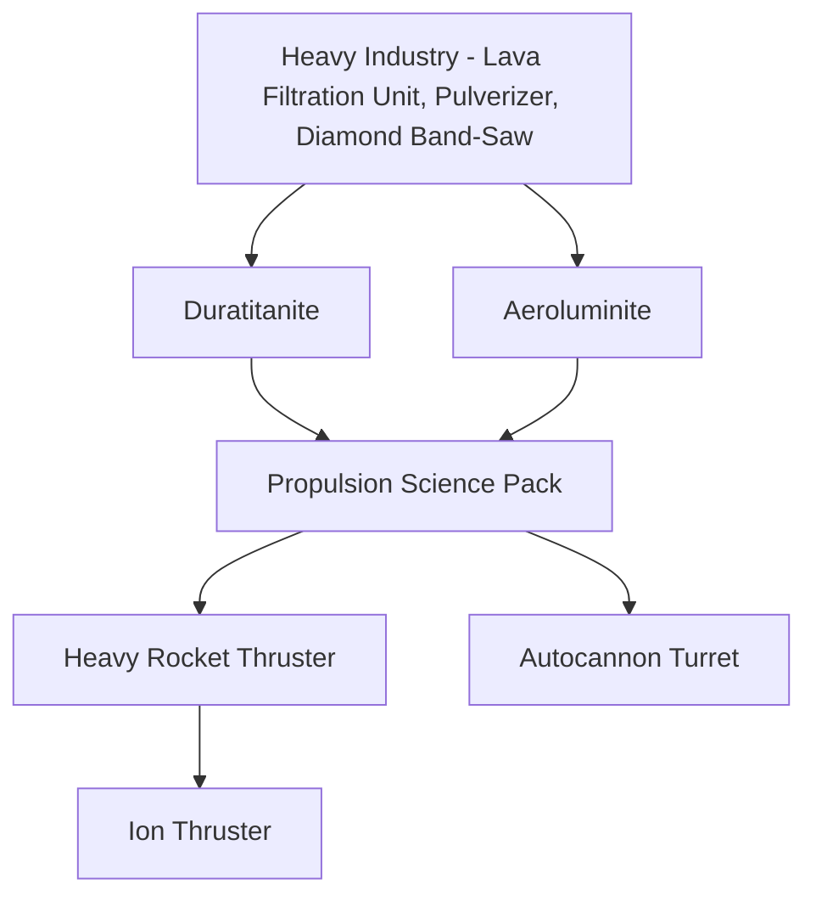
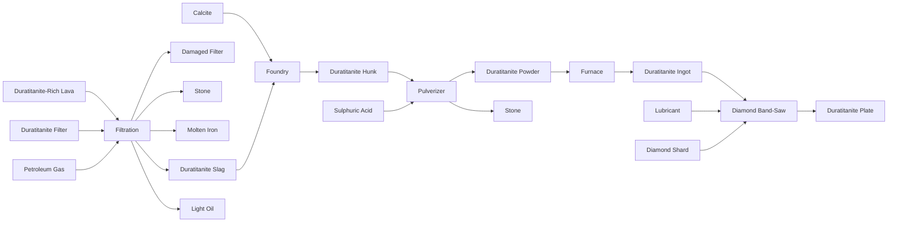
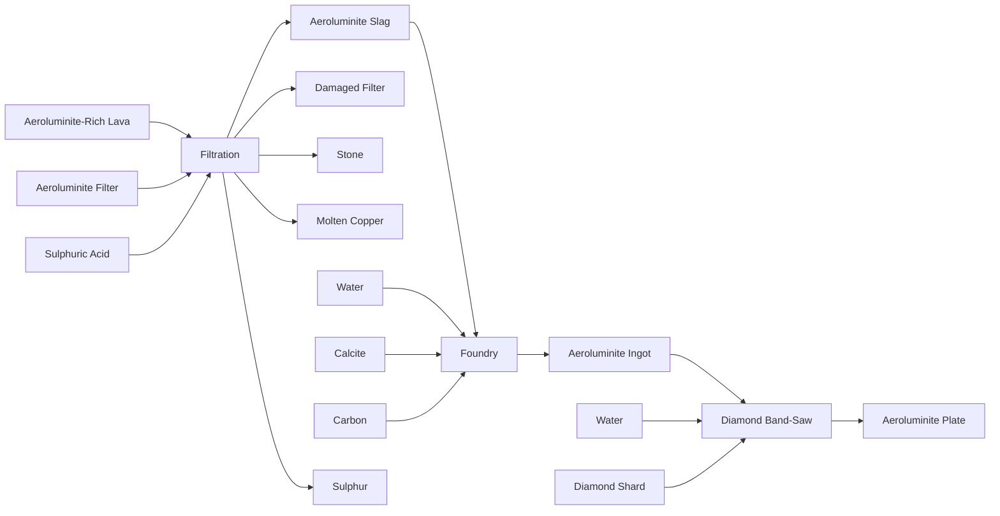

### Vulcanus TODO
1. Behavioral
    1. ~~Rich-lava filtration machine~~
        1. ~~Use re-colored chem plant or foundry~~
    1. ~~Pulverizer machine~~
        1. ~~Use re-colored crusher~~
    1. ~~Diamond band-saw machine~~
        1. ~~Use re-colored assembly machine~~
    1. ~~Basic Lava Filter~~
        1. ~~Tungsten Carbide~~
        1. ~~Copper Cable~~
        1. ~~Steel~~
    1. ~~Damaged Lava Filter~~
    1. ~~Duratitanite lava filter~~
    1. ~~Duratitanite-rich lava~~
    1. ~~Duratitanite slag recipe~~
    1. ~~Duratitanite hunk recipe~~
    1. ~~Duratitanite powder recipe~~
    1. ~~Duratitanite ingot recipe~~
    1. ~~Duratitanite plate recipe~~
    1. ~~Aeroluminite lava filter~~
    1. ~~Aeroluminite-rich lava~~
    1. ~~Aeroluminite slag recipe~~
    1. ~~Aeroluminite ingot recipe~~
    1. ~~Aeroluminite plate recipe~~
    1. ~~Propulsion science pack~~
    1. ~~Autocannon turrets~~
    1. ~~Heavy rocket thrusters~~
    1. ~~Asteroid processing recipes to get aeroluminite, duratitanite, and STONE in orbit~~
    1. ~~Industrial Productivity Module~~
1. Enemies
    1. ~~Infant/Adolescent demolishers~~
1. Graphics

## Tech Tree

```mermaid
    graph TD;
        HI[Heavy Industry - Lava Filtration Unit, Pulverizer, Diamond Band-Saw]
        T[Duratitanite]
        A[Aeroluminite]
        HRT[Heavy Rocket Thruster]
        AC[Autocannon Turret]
        IT[Ion Thruster]
        PSP[Propulsion Science Pack]

        HI-->T
        HI-->A
        HRT-->IT
        T-->PSP
        A-->PSP
        PSP-->AC
        PSP-->HRT
```

## Duratitanite Processing Flow

```mermaid
    graph LR;
        LT[Duratitanite-Rich Lava]
        TS[Duratitanite Slag]
        TH[Duratitanite Hunk]
        TPow[Duratitanite Powder]
        TI[Duratitanite Ingot]
        TP[Duratitanite Plate]

        TF[Duratitanite Filter]
        DF[Damaged Filter]

        S1[Stone]
        S2[Stone]
        I[Molten Iron]
        FO[Foundry]
        C[Calcite]
        FI[Filtration]
        PV[Pulverizer]
        F[Furnace]
        DBS[Diamond Band-Saw]
        L[Lubricant]
        SI[Sulphuric Acid]
        DS[Diamond Shard]
        PG[Petroleum Gas]
        LO[Light Oil]

        LT-->FI
        TF-->FI
        PG-->FI
        C-->FO
        TS-->FO
        TH-->PV-->TPow-->F-->TI-->DBS-->TP
        SI-->PV
        PV-->S2
        FI-->TS
        FI-->S1
        FI-->I
        FI-->LO
        FI-->DF
        FO-->TH
        L-->DBS
        DS-->DBS
```

## Aeroluminite Processing Flow

```mermaid
    graph LR;
        LA[Aeroluminite-Rich Lava]
        AS[Aeroluminite Slag]
        AP[Aeroluminite Plate]
        AI[Aeroluminite Ingot]
        DBS[Diamond Band-Saw]

        AF[Aeroluminite Filter]
        DF[Damaged Filter]
        
        S1[Stone]
        FI[Filtration]
        MC[Molten Copper]
        FO[Foundry]
        SA[Sulphuric Acid]
        L[Water]
        C[Calcite]
        CA[Carbon]
        W2[Water]
        DS[Diamond Shard]
        S[Sulphur]

        LA-->FI-->AS-->FO-->AI-->DBS-->AP
        AF-->FI
        FI-->S1
        FI-->MC
        FI-->S
        FI-->DF
        SA-->FI
        W2-->DBS
        DS-->DBS
        L-->FO
        C-->FO
        CA-->FO
```