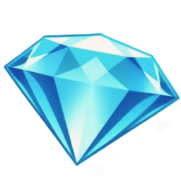
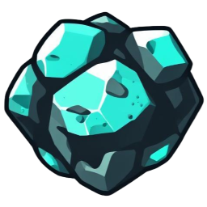
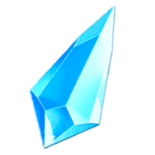
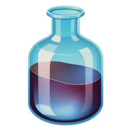
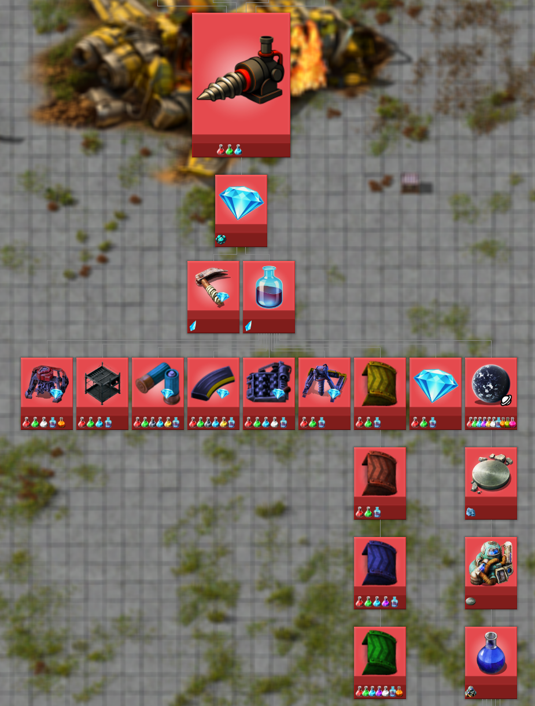

# SUBTERRANIO

### Explore underground caverns, but beware what other creatures lurk in the dark. Bring some lights... and some guns

---

## New Resources! 💎
### Diamonds!

Mine for diamonds, crush them into shards, and grow your factory!

  

## New Technology! 💎

Utilize subterranean science packs to unlock new diamond-based technology!

* #### Tunnelling drill equipment to go between surfaces
* #### Mineshaft belts to connect the surface and underground
* #### Mineshaft pipes to connect the surface and underground
* #### Diamond-Tipped Mining Drills - faster drills
* #### Diamond-Tipped Big Mining Drills - faster drills
* #### Diamond-Tipped Crushers - faster crushers
* #### Diamond-Core Ammunition - bullets and shotgun
* #### Diamond-Tipped Pickaxe - for faster pickup and mining

## Roadmap 💎

### Beta-Complete: Nauvis

### Next: Fulgora
### Then: Vulcanus, Gleba, Aquilo, and more!

## For Mod Developers 💎
### API Docs

API Docs can be found in the `subterranio-base/source/scripts/init.lua` file

## Credits & License 💎
* The geothermal power plant uses graphics from Hurricane046's buildings (CC BY license)